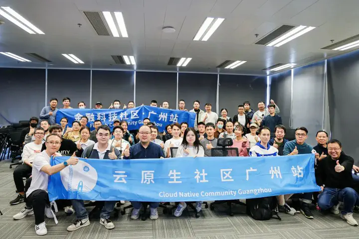

## 原子微服务和组合微服务

## 附录1：演讲说明

这个演讲先后在两个场合讲过，内容都是一样的，只是名字不一样：

1. [WOT2023全球技术创新大会](https://wot.51cto.com/act/wot2023/shenzhen#nav)

   - 演讲主题：[让服务编排和分布式事务变得简单](https://wot.51cto.com/act/wot2023/shenzhen/page/publisher?publisher_id=1277)
  
   - 演讲时间：2023/11/25
  
   - 演讲地点：深圳 前海JEN酒店

2. [2023 云原生金融科技开放日](https://cloudnativecn.com/event/cloud-native-meetup-guangzhou-13/)

   - 演讲主题：[少即是多：Dapr Workflow 中的简繁之争(点击可观看B站视频)](https://www.bilibili.com/video/BV1Fc411X7C4/?spm_id_from=333.1387.collection.video_card.click)

   - 时间：2023/12/2

   - 地点：广州 天安人寿中心

   - 大会介绍：https://wot.51cto.com/act/wot2023/shenzhen#nav

## 附录2：纪念周圣华君

这是广州云原生金融科技开放日当天拍的合影，照片第一排从左到右依次为张晓辉，周圣华，我。

这是周圣华君生前和我的最后一次合影，一个多月后，他不幸因心梗离世，音容犹在，斯人已逝。

